# Quizzical

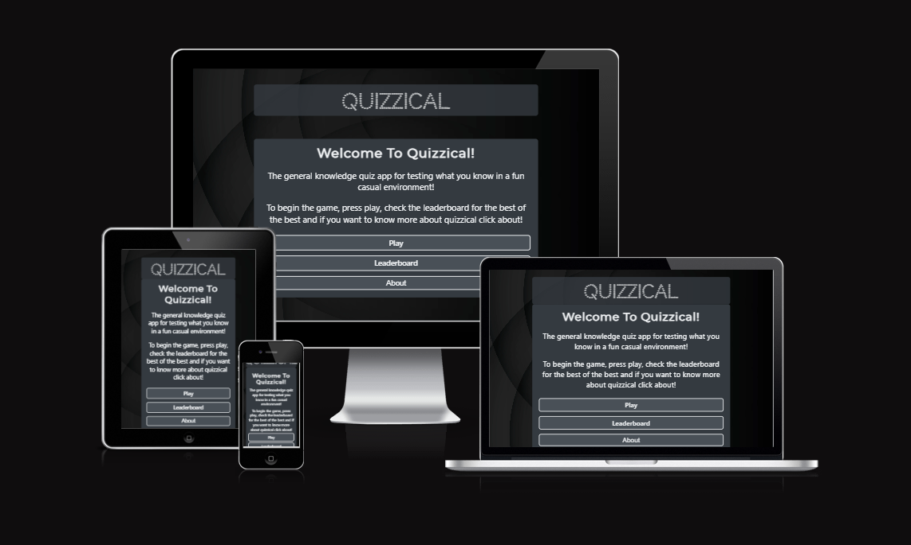

Visit the deployed site: [Quizzical](https://shaAnder.github.io/Quizzical/)

A general knowledge app for fun!

There's nothing better than learning something new! General knowledge and fun facts never go wrong in a party and this app will help you have all the quiz and trivia knowledge you could ever need!

[Google Scholar](https://scholar.google.com/scholar?q=studies+about+quizzes&hl=en&as_sdt=0&as_vis=1&oi=scholart) shows that there are many studies and articles proving the benefit of quizzes and quiz based learning.

Quizzes are always fun, and have proven to be popular in many settings and at many events, coupled with the obvious benefit of learning and information retention there's never a bad time to enjoy a good quiz.

## CONTENTS

- [User Experience](#user-experience-ux)

  - [User Stories](#user-stories)

- [Design](#design)

  - [Colour Scheme](#colour-scheme)
  - [Typography](#typography)
  - [Imagery](#imagery)
  - [Wireframes](#wireframes)
  - [Features](#features)
    - [The Home Page](#the-home-page)
    - [The Signup Page](#the-signup-page)
    - [The Activities Page](#the-activities-page)
    - [The Discipline Chosen Page](#the-discipline-chosen-page)
    - [The Activity Chosen Page](#the-activity-chosen-page)
    - [Future Implementations](#future-implementations)
  - [Accessibility](#accessibility)

- [Technologies Used](#technologies-used)

  - [Languages Used](#languages-used)
  - [Frameworks, Libraries & Programs Used](#frameworks-libraries--programs-used)

- [Deployment & Local Development](#deployment--local-development)

  - [Deployment](#deployment)
  - [Local Development](#local-development)
    - [How to Fork](#how-to-fork)
    - [How to Clone](#how-to-clone)

- [Testing](#testing)
  - [Solved Bugs](#solved-bugs)
  - [Known Bugs](#known-bugs)
- [Credits](#credits)
  - [Code Used](#code-used)
  - [Content](#content)
  - [Media](#media)
  - [Acknowledgments](#acknowledgments)

---

## User Experience (UX)

### User Stories

#### First Time Visitor Goals

- I want a fun quiz game where I can choose my own difficulty and length
- I want to learn new and fun things while playing this game
- I I want the site to be responseive
- I want the game to allow me to save my highscore, so that I can try to beat it later

#### Returning Visitor Goals

- I want to have clear feedback on my score, the questions and which question i got right or wrong
- I want to be able to input my own name / team name for the game

---

## Design

### Colour Scheme

For the colors I decided to opt for a colorset that was sleek and modern, using a black geometric background it to me inspired a sense of sophistication and intellect.

In my css file I have used variables to declare colours, and then used these throughout the css file. Variable are a fantastic way to enforce consistency and allow us to create more complex code that we don't need to alter at every turn.

From this color palette we stuck to mainly a monotone and grayscale look, as I wanted to enforce a neutral tone. Originally I had opted for a gold coloured lettering on the buttons, however dropped this as it clashed with the traditional red and green you see for correct and incorrect answers in quizzes.

### Typography

For our typography I opted for two primary fonts, firstly I went with [CodyStar](https://fonts.google.com/specimen/Codystar), this font is geometric while somewhat stylized, and I thought it fit the overall visual designeds nicely

For a secondary font I opted for [Montserrat](https://fonts.google.com/specimen/Montserrat) this is a tried and true font that works in every occasion, and again looks neat, sensible and is great for paragraphs and headings alike.

### Imagery

As the app is mainly a quiz app the imagery was kept to a minimum or non existent, I would have added some imagery in given more time but due to constraints opted to keep it simple and stylistic

### Wireframes

Wireframes were created for mobile, tablet and desktop using balsamiq.

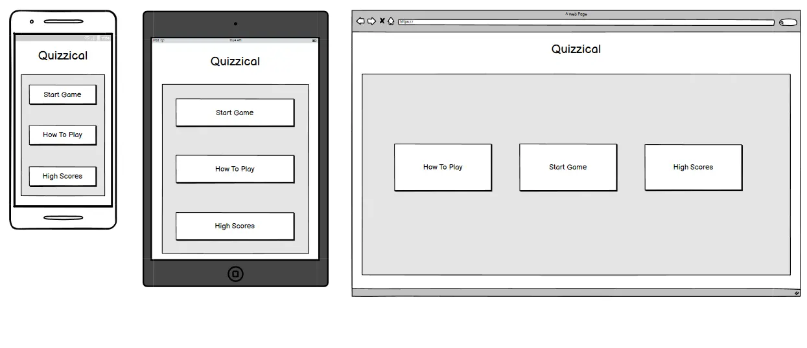
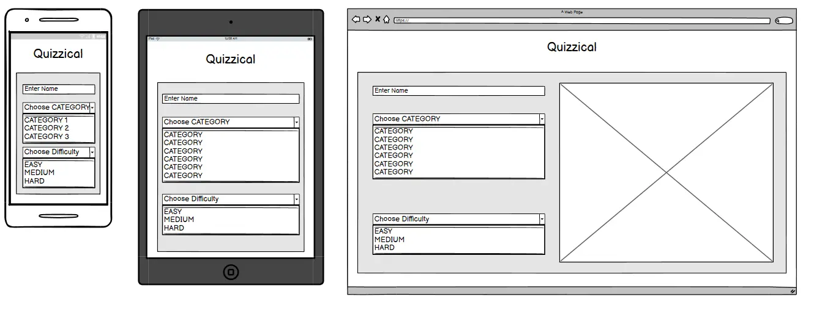
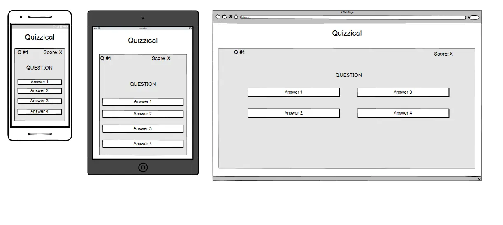
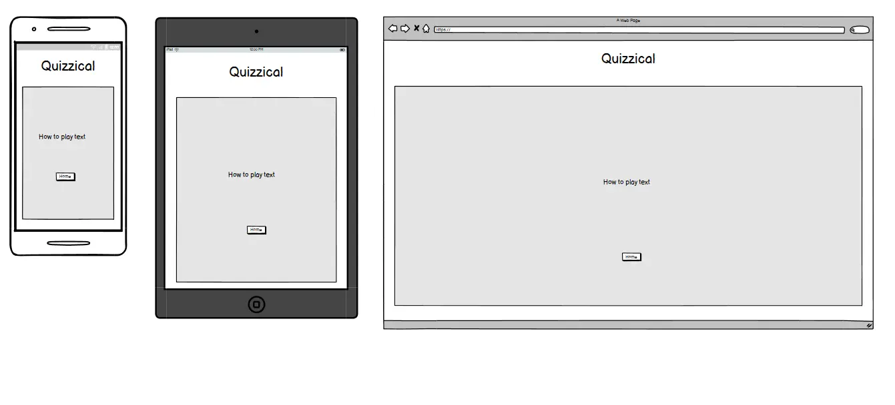
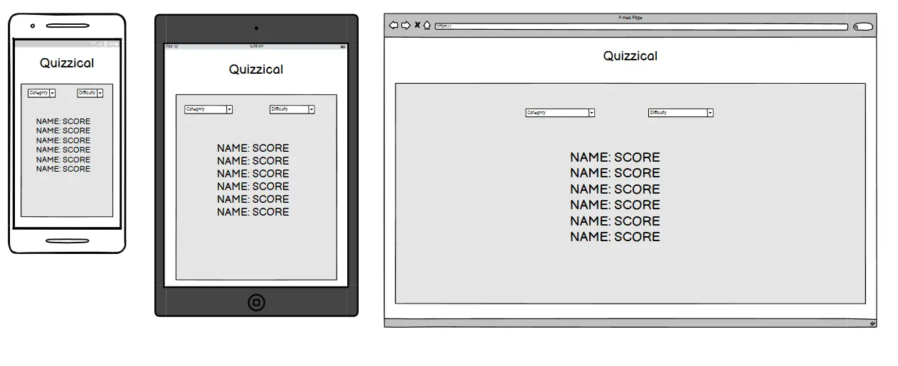
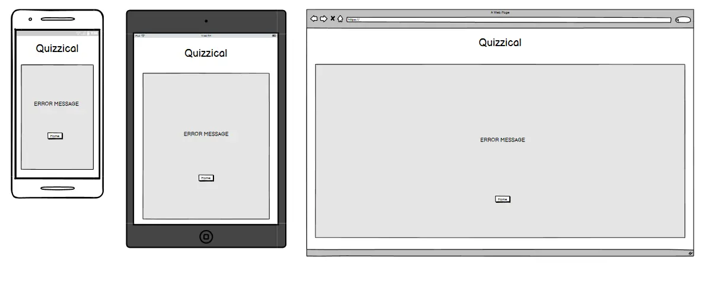

Overall the design changed over the course of development as I could not finish all the features I wanted in the time I had. It still retains a similar style to what I wanted however.

### Features

The website is comprised of a home page, an about page, highscores page and an error page in the event one is needed.

All Pages on the website are responsive and have:

- A favicon in the browser tab.

  

- The title of the site at the top of every page. This title also acts as a link back to the home page.
  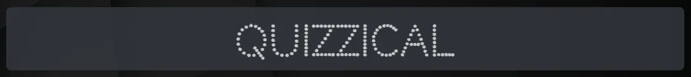

#### The Home Page

The home page of Quizzical is a simple yet elegant page mirroring a lot of quiz app main menus, there's a play button, that starts the game, a leaderboard button that takes the user to the scores and a how to play that opens a modal window that gives the user more detailed instructions.

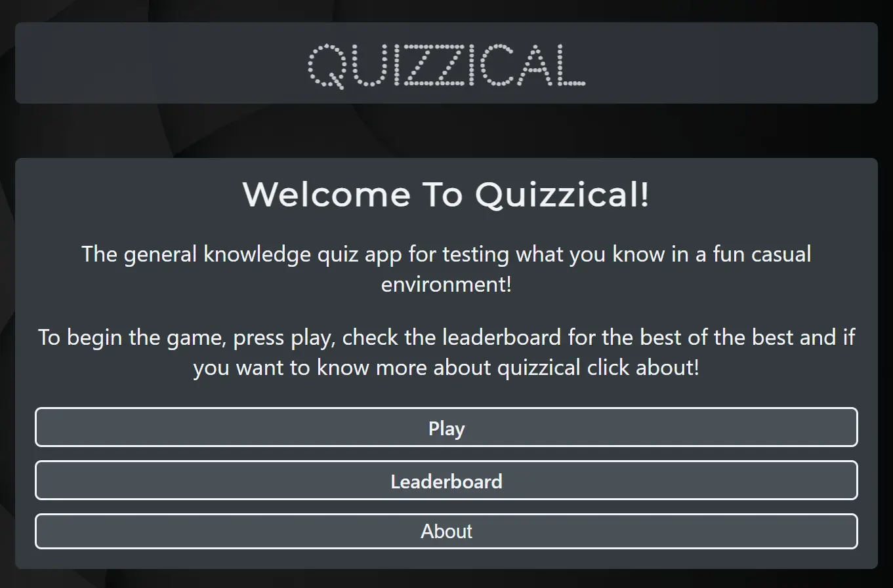

This page includes some information about the company and what we do / why wellness is so important.

#### The About Page

While not so much a page, and more of a modal window, the about gives a deeper dive into what quizzical is about, how to play and credits.

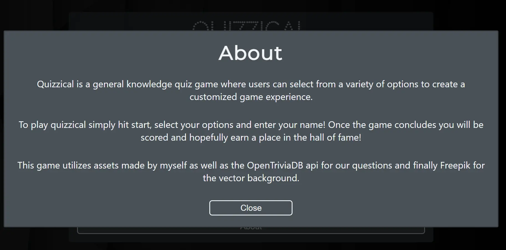

Clicking either of these sections will lead the user to the relevant page, which at the moment only contains some fun facts about yoga and meditation but in the future aims to cover guides and tutorials on how to do the activities correctly

#### The Highscores page

Next we have the highscores page, or leaderboard, this shows users who has the highest score and allows users to submit their own should they make it to the leaderboard.

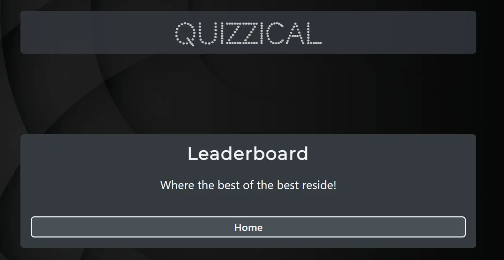

#### The Confirm Page

Now we have the game options and the game page, these are 2 parts of the same piece, the game options allows the user to set their question number, the difficulty and to also set a name for the score later.

Where as the game plays out as a quiz, where the user chooses an answer and then gets told if it's right or wrong through colorful feedback. Before proceeding to the next question.

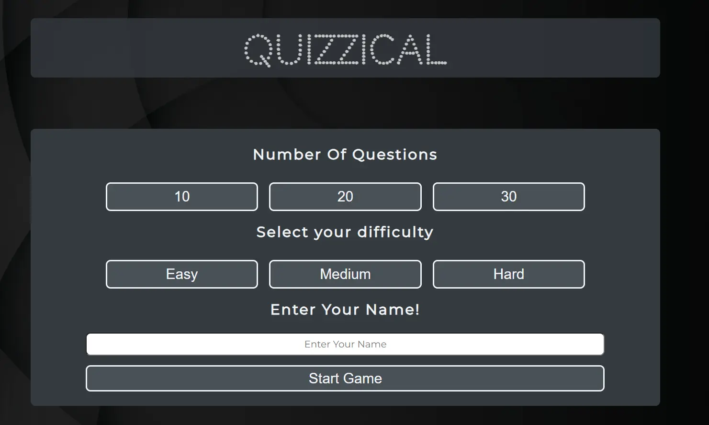
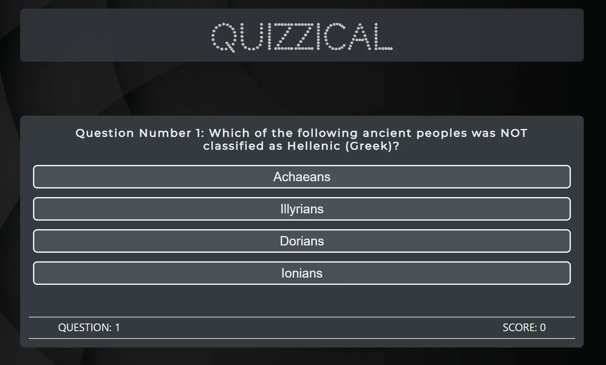

#### Future Implementations

As this app was done on a time limit and I didn't get to implement alot of what I know of JS, i definitely want to revisit this app again.

Firstly id consider rebuilding it in REACT as the state management aspects of that framework would make the application run so much smoother.

Other implementations I want to consider are:

1. Building in a select category method
2. Adding more comprehensive highscores, as well as the ability to sort through them in a variety of ways
3. adding more visual flair to the application
4. Building out the difficulty options, with timers for questions ect

These are some of many ideas I have for this application

### Accessibility

While I think the website does have a good host of accessibility i do wish to add more options where avaible, such as a wider range of support for devices and ARIA features.

---

## Technologies Used

### Languages Used

HTML, CSS, JS

### Frameworks, Libraries & Programs Used

- [Balsamiq](https://balsamiq.com/) - Used to create wireframes.

- [Git](https://git-scm.com/) - For version control.

- [Github](https://github.com/) - To save and store the files for the website.

- [GitPod](https://gitpod.io/) - IDE used to create the site.

- [Google Fonts](https://fonts.google.com/) - To import the fonts used on the website.

- [Google Developer Tools](https://developers.google.com/web/tools) - To troubleshoot and test features

- [Favicon.io](https://favicon.io/) To create favicon.

- [Am I Responsive?](http://ami.responsivedesign.is/) To show the website image on a range of devices.

- [Shields.io](https://shields.io/) To add badges to the README

- [Lighthouse](https://chrome.google.com/webstore/detail/lighthouse/blipmdconlkpinefehnmjammfjpmpbjk?pli=1) - a chrome extension to rate the site based on performance, accessibility, seo and Best practices

- [Web Disability Simulator](https://chrome.google.com/webstore/detail/web-disability-simulator/olioanlbgbpmdlgjnnampnnlohigkjla) - a google chrome extension that allows you to view your site as people with accessibility needs would see it.

- [Webpage Spell-Check](https://chrome.google.com/webstore/detail/webpage-spell-check/mgdhaoimpabdhmacaclbbjddhngchjik/related) - a google chrome extension that allows you to spell check your webpage. Used to check the site and the readme for spelling errors.

---

## Deployment & Local Development

### Deployment

The site is deployed using GitHub Pages - [Quizzical](https://shaAnder.github.io/Quizzical/).

To Deploy the site using GitHub Pages:

1. Login (or signup) to Github.
2. Go to the repository for this project, [shaAnder/Quizzical](https://github.com/shaAnder/Quizzical).
3. Click the settings button.
4. Select pages in the left hand navigation menu.
5. From the source dropdown select main branch and press save.

### Local Development

#### How to Fork

To fork the repository:

1. Log in (or sign up) to Github.
2. Go to the repository for this project, [shaAnder/Quizzical](https://github.com/shaAnder/Quizzical)
3. Click the Fork button in the top right corner.

#### How to Clone

To clone the repository:

1. Log in (or sign up) to GitHub.
2. Go to the repository for this project, [shaAnder/Quizzical](https://github.com/shaAnder/Quizzical)
3. Click on the code button, select whether you would like to clone with HTTPS, SSH or GitHub CLI and copy the link shown.
4. Open the terminal in your code editor and change the current working directory to the location you want to use for the cloned directory.
5. Type 'git clone' into the terminal and then paste the link you copied in step 3. Press enter.

---

## Testing

Please refer to [TESTING.md](TESTING.md) file for all testing carried out.

## Final Declaration of authenticity and credit.

I declare that the work in this readme and code base is of my own design and that no plagarism was committed in creating this work. I took a lot of inspiration from tutorials and places like stack overflow to help me solve various problems. As well as this I used elements of my own codebase (other projects built in react ect) adapted to js to complete this project in a timely manner

The background Image for this was found on FREEPIK

All other assets were created by me
