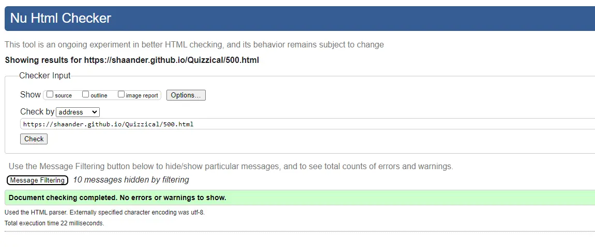

# Quizzical - Testing

(variety image here)

Visit the deployed site: [Quizzical](https://shaAnder.github.io/Quizzical)

---

## CONTENTS

- [AUTOMATED TESTING](#automated-testing)
  - [W3C Validator](#w3c-validator)
  - [JavaScript Validator](#javascript-validator)
  - [Lighthouse](#lighthouse)
- [MANUAL TESTING](#manual-testing)
  - [Testing User Stories](#testing-user-stories)
  - [Full Testing](#full-testing)

Throughout the entire build testing was on going, each new feature was rigorously tested to make sure it was working when used.

To aid in development google dev tools, as well as lighthouse, the w3 validators, spellcheck and disabiliy view plugins were utilized were utilized to ensure everything worked to standard

I also went through each page and tested the features vs my established user stories to ensure it was all working correctly

---

## AUTOMATED TESTING

### W3C Validator

[W3C](https://validator.w3.org/) was used to validate the html and css to check for errors and consistency

Index - Passed.

Game - Passed.

Leaderboard - Passed.

500 - Passed.

Style.css - Passed.

For javascript validation the website was subjected to multiple validators that all stated the only problems were the use of es6 specific concepts

---

### Lighthouse

I also used the lighthouse chrome plugin to run checks for each page on both desktop and mobile view. I focued my efforts on attaining a high level of accessibility, best practices and seo, performance was attained where it was able but seeing as we were not tought about website optimization yet it wasn't high on my list of priorities.

### Desktop Results

The desktop results all performed similarly and as expected, perfect to almost perfect across the board

### Mobile Results

The mobile results were more of the same the performance was a bit lower due to the sizing of the images, however adding preloaded images in seemed to fix this.

---

## MANUAL TESTING

### Testing User Stories

`First Time Visitors`

| Goals                                                                                | How are they achieved?                                                                                                                                                                                                   |
| :----------------------------------------------------------------------------------- | :----------------------------------------------------------------------------------------------------------------------------------------------------------------------------------------------------------------------- |
| I want a fun quiz game where I can choose my own difficulty and length               | The site was designed with user interaction and enjoyment in mind, users can not only choose their difficulty but also have the option to choose the amount of questions they play for                                   |
| I want to learn new and fun things while playing this game                           | I developed this app using the open trivia API at it's core, this app utilizes random category selection to ensure that the questions are fun different and unique every time.                                           |
| I want the site to be responseive                                                    | The site is built with a responsiveness and easy navigation in mind with a varity of buttons that clearly mark where they will take the user as well as quick nav links informational tooltips to help the user navigate |
| I want the game to allow me to save my highscore, so that I can try to beat it later | The game features a highscore system that allows the player to save their score and come back to beat it at any time                                                                                                     |

`Returning Visitors`

| Goals                                                                                            | How are they achieved?                                                                |
| :----------------------------------------------------------------------------------------------- | :------------------------------------------------------------------------------------ |
| I want to have clear feedback on my score, the questions and which question i got right or wrong | The website is designed to be clear and intuitive to the user and gives easy feedback |
| I want to be able to input my own name / team name for the game                                  | Users are able to setup their own name when they start a game                         |

---

### Full Testing

Full testing was performed with google chrome as a baseline, i thenutilized the responsive design features to test on a variety of screen sizes

Screen sizes tested:

Mobile Phone:

- Samsung S8+

Tablet Size:

- I pad mini

Laptop / Desktop / Browser:

- Google chrome
- Opera Gx
- Firefox

Additionally I tested this using both of my mobile phones and no issue was found:

- Galaxy A33 5g
- Samsung S5

As well as this testing was taken by friends and family and any issues found were minor and could not be replicated within reasonable testing

Finally I tested each feature implemented and got the following results

| Feature                               | Expected Outcome                                                             | Testing Performed                                     | Result                                | Pass/Fail |
| ------------------------------------- | ---------------------------------------------------------------------------- | ----------------------------------------------------- | ------------------------------------- | --------- |
| The Sites title                       | Link directs the user back to the home page                                  | Clicked title                                         | Directed back to home page            | Pass      |
| The various buttons                   | Buttons to the different pages all worked                                    | Clicked Links                                         | Directed to various pages             | Pass      |
| All buttons - hover effect            | All buttons changed effect when hovered                                      | Hovered over buttons on page                          | Each button displayed correct styling | Pass      |
| Interactive Elements                  | All Interactive elements changed color when hovered                          | hovered over elements and links                       | Links changed color / moved           | Pass      |
| Game options                          | User can select custom settings for their game                               | Played through multiple games with different settings | Worked as inteneded                   | Pass      |
| Question game loop worked as expected | Users were able to play and finish the game                                  | Played through the game multiple times                | Game was playable and finisheable     | Pass      |
| Highscore saving                      | user can save their highscore via local storage                              | played the game multiple times and saved scores       | Scores saved as expected              | Pass      |
| Return home buttons                   | Added a button to return home on the confirm page designed to take user home | Clicked button                                        | Sent to home                          | Pass      |

### Known Bugs

Currently there are four known bugs:

- When playing through the game too fast the game may fail to update the innerHTML of the question count causing a brick, this is due to elements being called before they are ready
- Out of all the games I and others have played, twice the abilitiey to save to leaderboard failed to trigger
- One person noted that the game didn't show properly on their phone, using responsive settings have been unable to replicate this.
- Favicon doesn't show on some page loads
- Mobile Specific -> added a function that adds styling to selected buttons for user feedback, currently only works on second click of buttons, causing inaccurate user feedback
